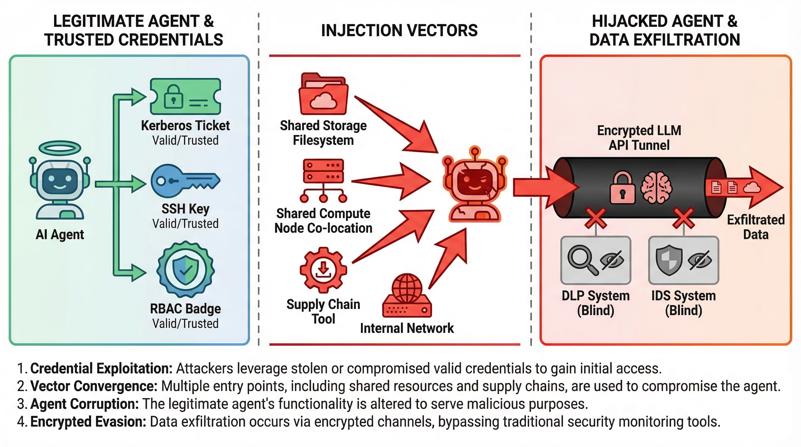
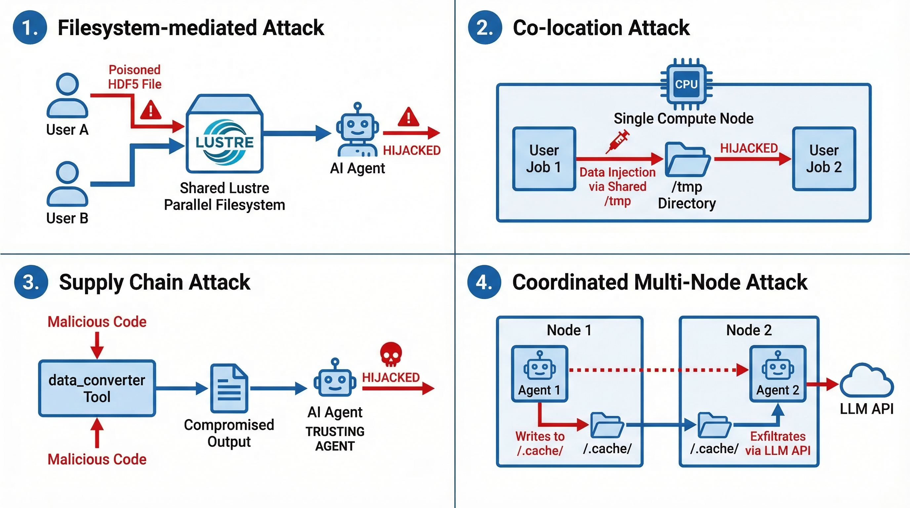
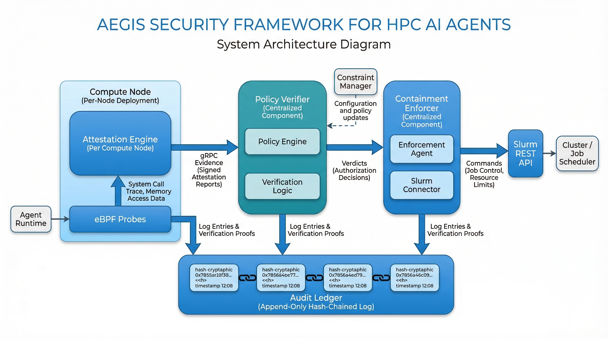
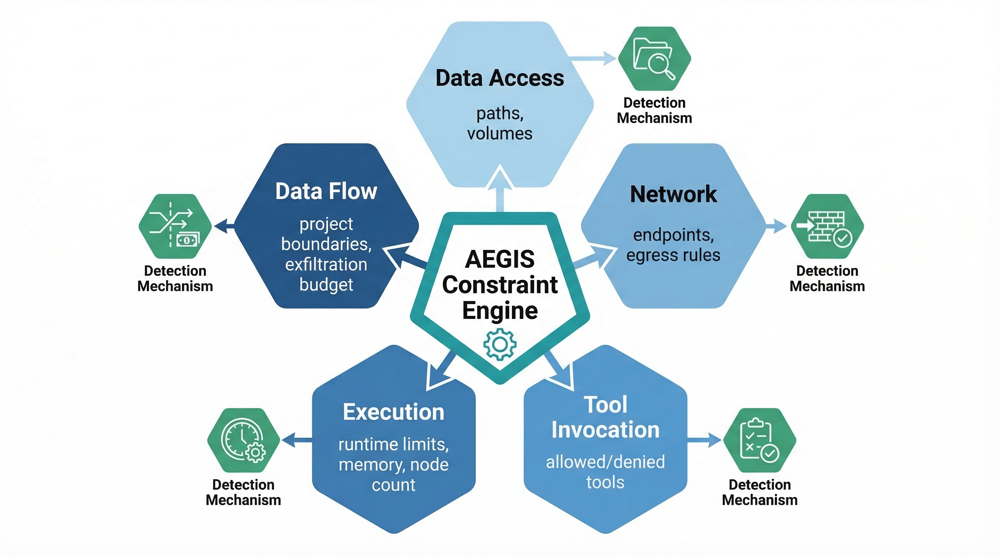
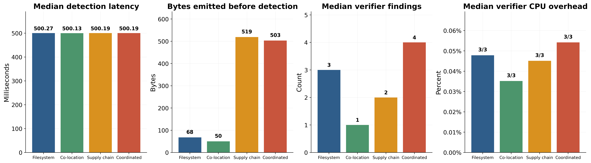
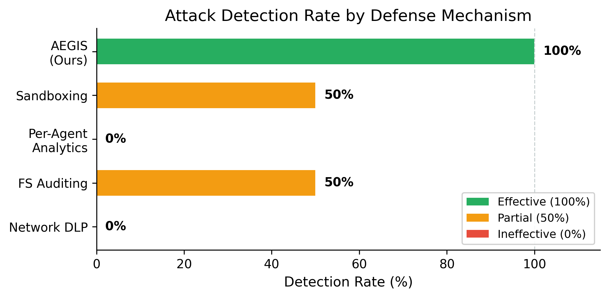
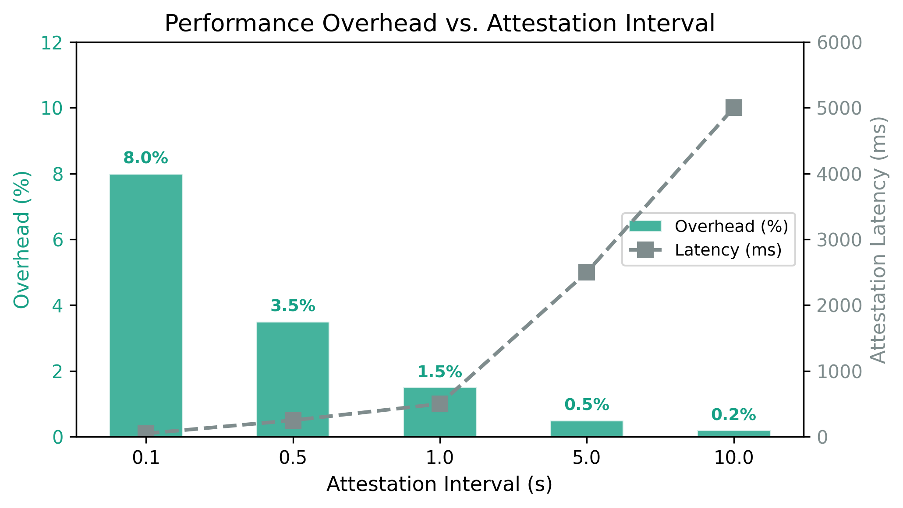
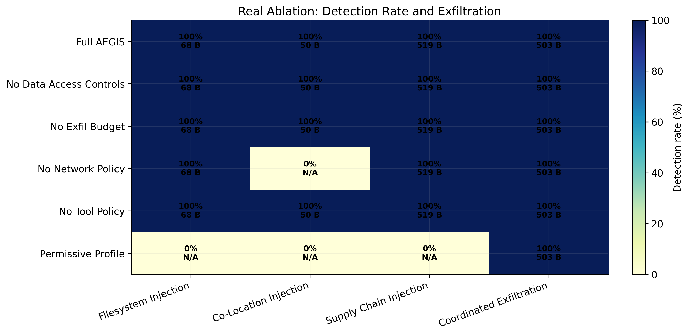
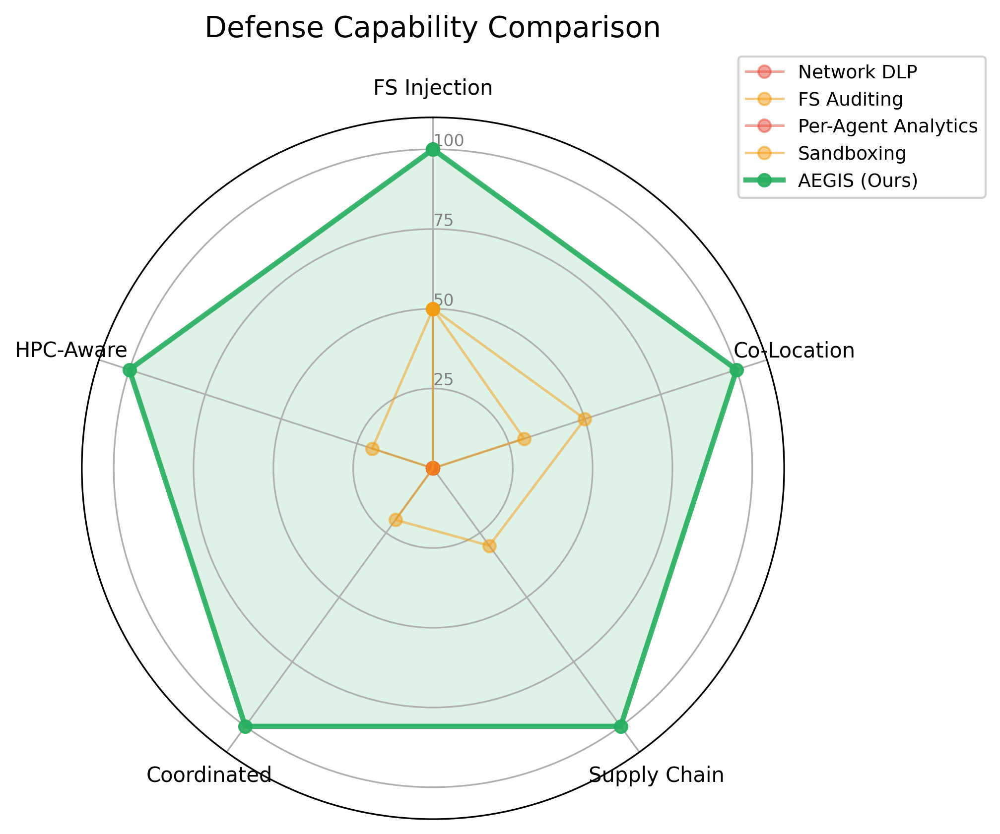

# PROPOSAL.md — AEGIS Research Proposal

## Paper Title

**Attestation is All You Need: Toward a Zero-Trust Architecture for HPC AI Agents**

## Target Venue

**SC26** — The International Conference for High Performance Computing, Networking, Storage and Analysis
- Website: https://sc26.supercomputing.org
- Abstract deadline: ~April 2026
- Full paper deadline: ~April/May 2026 (check for exact dates)
- Notification: ~July/August 2026
- Conference: November 2026

## Abstract

AI agents entering HPC introduce a threat that HPC security was never designed to handle: the *hijacked authorized agent*. Through prompt injection attacks via shared filesystems, co-located nodes, or compromised tools, an adversary subverts an agent with valid credentials. The hijacked agent exfiltrates data through encrypted, whitelisted LLM API channels , invisible to traditional monitoring.

We propose **behavioral attestation** for securing AI agents in HPC. Rather than probabilistic detection or signature-based blocking, attestation provides provable, constraint-based guarantees that an agent operates within authorized behavioral boundaries, with runtime containment before exfiltration.

We formalize four HPC-specific injection attack vectors, design and implement AEGIS (Attestation-based Environment for Guarding Injection-vulnerable Systems), and demonstrate that behavioral attestation detects all attacks while traditional defenses fail: network DLP detects 0% (encrypted API), filesystem auditing 50% (no intent awareness), per-agent analytics 0% (no cross-agent correlation). AEGIS introduces minimal overhead with zero false positives across representative workflows.

## 1. Introduction

> *While attention gave agents the power to reason, attestation gives the system the power to trust them.*

AI agents are entering high-performance computing. Autonomous experiment loops steer simulations in real time. ML training agents orchestrate multi-node workflows without human intervention. Data analysis agents read, transform, and summarize petabytes of scientific output. These agents promise to dramatically accelerate scientific discovery , but they also introduce a threat that HPC security was never designed to handle.

The problem is not that AI agents are untrustworthy. The problem is that they are *too* trustworthy , to the wrong inputs. An agent authorized to process genomics data for Project X will faithfully execute whatever instructions it receives, including instructions hidden inside that data by an attacker. A prompt injection payload embedded in a FITS file header, a malicious instruction in a shared `/tmp` directory, a compromised tool returning hidden commands ; these are not hypothetical threats. They are the natural consequence of deploying instruction-following systems into environments where untrusted data is the norm.

This paper identifies and formalizes a threat that has not been studied in prior work: **the hijacked authorized agent in HPC**. Unlike rogue agents (which existing authentication blocks) or adversarial agents (which existing authorization constrains), a hijacked agent operates with the full credentials and privileges of a legitimate user. It does not need to escalate privileges ; it already has them. It does not need to bypass access controls ; it is already authorized. It appears legitimate to every monitoring system that checks identity, as its identity is legitimate. It exfiltrates data through the one channel no HPC system inspects: the encrypted LLM API connection the agent requires to function.

The attack surface is uniquely HPC. Shared filesystems (Lustre, GPFS) create injection surfaces , where an attacker places adversarial content in a project directory, and the target agent reads it as trusted scientific data. Multi-tenant compute nodes create co-location injection vectors , where an attacker's agent writes to shared `/tmp`, and a co-located target agent picks it up. Agent skill ecosystems create supply chain attacks , where a compromised tool injects instructions from within the agent's trusted execution context. Coordinated multi-agent exfiltration distributes data theft across nodes and users, evading per-agent detection entirely.

Existing defenses fail against this threat. Authentication succeeds because the agent has valid credentials. Authorization succeeds because the agent has legitimate permissions. Network monitoring is blinded by encryption. DLP is bypassed because data is encoded in whitelisted API calls. User behavior analytics see nothing anomalous because the agent's workflow patterns are consistent with its authorized role.

We propose **behavioral attestation** as the foundation for securing AI agents in HPC. Our key insight is simple: *we cannot prevent all injection attacks, but we can contain their effects*. Even if an agent is hijacked, we can detect when it violates its behavioral constraints, accessing files outside its authorized project, connecting to non-whitelisted endpoints, invoking unauthorized tools, and contain the violation before data exfiltration occurs.

Behavioral attestation differs from prior approaches in three fundamental ways:

- **Attestation, not detection.** Existing agent security relies on ML-based classifiers that provide probabilistic alerts with inherent false positive and negative rates. Behavioral attestation provides *provable guarantees*: an agent either satisfies its constraints or it does not. There is no ambiguity.

- **Constraint-based, not signature-based.** Existing defenses block known-bad patterns (signatures), which can be evaded through obfuscation. Constraints define what is *allowed*, not what is malicious. An unauthorized action is unambiguously a violation, regardless of how it is disguised.

- **Runtime, not post-hoc.** Existing monitoring alerts after the attack succeeds , meaning damage is already done. Behavioral attestation verifies constraints continuously during execution and enforces containment *before* exfiltration occurs.

This paper makes the following contributions: (1) formalization of the hijacked agent threat with four HPC-specific attack vectors not studied in prior work; (2) behavioral attestation as a provable, constraint-based, runtime security primitive for AI agents; (3) AEGIS, a complete zero-trust architecture encompassing constraint specification, attestation protocols, and automated containment; and (4) empirical evaluation demonstrating attack feasibility and defense effectiveness across all four attack vectors.

§2 provides background. §3 formalizes the threat model. §4 presents AEGIS. §5 describes experimental evaluation. §6 surveys related work. §7 discusses future directions. §8 concludes.

## 2. Background

### 2.1 Zero-Trust Architecture

Zero-Trust Architecture (ZTA), formalized in NIST SP 800-207 [1], operates on "never trust, always verify" , treating every access request as potentially hostile regardless of origin. Core tenets include per-session least-privilege access, dynamic decisions informed by multiple signals, and continuous monitoring [31]. While widely adopted in enterprise and cloud environments, applying ZTA to HPC presents unique challenges: performance sensitivity of scientific workloads, shared-resource clusters (filesystems, interconnects, schedulers), and the need to preserve collaborative, low-friction access patterns.

Recent work has begun addressing this gap. Alam et al. [2] deployed federated SSO with zero-trust controls for the Isambard-AI/HPC infrastructures in the UK. Duckworth et al. [3] proposed SPIFFE/SPIRE [26] for workload identity in HPC. Macauley and Bhasker [4] measured ZTA maturity implementation effort in HPC, finding the Identity pillar particularly challenging due to cost and complexity. Our work extends ZTA to a dimension these efforts do not address: *behavioral* trust of autonomous AI agents. Existing ZTA in HPC focuses on identity verification; for AI agents, identity verification must be complemented by *behavioral* verification — attesting not just to who the agent is, but to what it does.

### 2.2 AI Agents in HPC

AI agents — autonomous systems that perceive, reason, and act to achieve goals [21] — are entering HPC workflows, making dynamic decisions about data analysis, simulation parameters, and tool invocation during execution. Frameworks like Academy [5] and RHAPSODY [6] now support agent deployment across federated HPC ecosystems, while AgentBound [7] addresses access control for MCP servers [22], the emerging standard for connecting agents to external tools.

HPC environments introduce unique characteristics for agent operation: shared parallel filesystems (Lustre, GPFS) where access is governed by user-level POSIX permissions rather than project boundaries; multi-tenant compute nodes where schedulers like Slurm [25] co-locate jobs from different users sharing kernel-level resources (`/tmp`, shared memory); data-intensive workflows where agents routinely process terabytes of untrusted scientific data as authoritative input; and API-driven intelligence where LLM backends accessed over HTTPS create encrypted, whitelisted exfiltration channels by design.

### 2.3 Security in HPC

HPC security relies on a perimeter model: Kerberos/SSH authentication [29], RBAC through schedulers and POSIX permissions, boundary firewalls (internal traffic largely unencrypted for performance), and job accounting logs. This model has well-documented gaps [8]: lateral movement once authenticated, credential theft granting full access, overprovisioned filesystem permissions, and critically, no behavioral monitoring , the system verifies identity but not intent. These gaps are tolerable for human users constrained by awareness; they become critical for AI agents that follow instructions blindly, including adversarial ones. An agent has valid credentials (passes authentication), legitimate permissions (passes authorization), and consistent behavior patterns (passes analytics) , yet executes an attacker's commands.

### 2.4 Prompt Injection and Agent Security

Prompt injection — subverting an agent's instruction-following through adversarial inputs [10] — has emerged as a fundamental security challenge for LLM-based systems. Prior work focuses on web-based scenarios where agents encounter malicious content on the internet [11]. Existing defenses (input sanitization, instruction hierarchy, output filtering) have fundamental limitations: sanitization is incomplete (unbounded payload space), instruction hierarchy is fragile (Zou et al. [12] demonstrated universal adversarial suffix attacks bypassing LLM guardrails), and output filtering is probabilistic (ML classifiers have inherent error rates). Critically, this literature has not addressed HPC contexts where injection exploits shared infrastructure rather than web content.

## 3. Threat Model

**Figure 1:** The hijacked authorized agent threat. An agent with valid credentials (Kerberos, SSH, RBAC) is subverted through injection attacks. The hijacked agent exfiltrates data through encrypted LLM API channels invisible to traditional DLP and monitoring systems.

### 3.1 The Hijacked Agent Threat

We identify the most dangerous threat to HPC environments deploying AI agents: **the hijacked authorized agent**. Unlike rogue or malicious agents, which are blocked by existing authentication and authorization mechanisms, a hijacked agent operates under the full credentials and privileges of a legitimate user. It is not an intruder; it is a trusted insider that has been turned.

This threat arises from **prompt injection and tool poisoning attacks** against LLM-based agents. An attacker crafts inputs, through data files, tool outputs, shared documents, or collaborative channels, that subvert the agent's instruction-following behavior. The agent, now under adversarial control, executes commands indistinguishable from the legitimate user's intent.

A hijacked agent possesses four properties that make it uniquely dangerous in HPC:

1. **Full credential inheritance.** The agent operates with the user's Kerberos tickets, SSH keys, and scheduler permissions. No privilege escalation is needed; the agent already has access. From the access control system's perspective, every action is authorized.

2. **Cross-project filesystem access.** HPC shared filesystems (Lustre, GPFS, BeeGFS) are typically organized by user, not by project. A user authorized on Projects A, B, and C grants their agent simultaneous access to all three datasets. A hijacked agent can traverse project boundaries that would require separate authorization in a properly segmented system.

3. **Appearance of legitimacy.** The agent runs under an authorized user identity, invokes authorized tools, and follows authorized workflow patterns. Traditional anomaly detection fails because the agent's observable behavior (job submission, file I/O, network access) is consistent with its authorized role.

4. **Exfiltration through the LLM API channel.** The agent communicates with its LLM backend via HTTPS API calls. Sensitive data can be encoded into prompts or tool outputs and transmitted through this channel, which is:
   - Encrypted (invisible to network-level DLP)
   - Whitelisted (agents must communicate with the LLM to function)
   - High-bandwidth (prompts can contain large context windows)
   - Attributable to normal operation (no anomalous network destination)

This exfiltration vector is **invisible to traditional Data Loss Prevention (DLP)** systems, which inspect network traffic for sensitive data patterns. The LLM API channel bypasses this by design.

### 3.2 Threat Scenarios

**Scenario 1: Data file injection.** An attacker embeds a prompt injection payload in a scientific dataset (e.g., a comment field in a FITS header, a markdown cell in a Jupyter notebook). When the agent processes this file as part of a workflow, the injection hijacks the agent's subsequent actions.

**Scenario 2: Tool output poisoning.** A compromised or adversarial tool returns output containing hidden instructions. The agent, treating the tool output as trusted data, executes the injected commands.

**Scenario 3: Collaborative channel attack.** In multi-agent workflows (e.g., Academy-style federated agents), a compromised agent in one project injects instructions through inter-agent communication, propagating the hijack laterally across project boundaries.

**Scenario 4: Supply chain compromise.** A malicious update to an agent framework, dependency library, or model weights introduces a backdoor that activates when specific conditions are met, exfiltrating data through the normal API channel.

### 3.3 Adversarial Capabilities

We assume an adversary with the following capabilities:

| Capability | Assumption |
|---|---|
| Prompt injection | Can craft inputs that subvert agent instruction-following |
| Network access | Can observe encrypted traffic metadata (timing, volume) but not content |
| HPC access | No direct HPC account; must operate through hijacked agents |
| Time horizon | Can persist across multiple agent sessions and job submissions |

We explicitly **do not** assume the adversary can compromise the scheduler or resource manager, access the LLM provider's infrastructure, or subvert hardware roots of trust (TPM, secure enclaves).

### 3.4 Why Existing Defenses Fail

| Defense | Why it fails against hijacked agents |
|---|---|
| Authentication (Kerberos, SSH) | Agent has valid credentials, authentication succeeds |
| Authorization (RBAC, ACLs) | Agent has legitimate permissions, authorization succeeds |
| Network monitoring (IDS/IPS) | LLM API traffic is encrypted and whitelisted |
| DLP | Data exfiltration is encoded in encrypted API calls |
| User behavior analytics | Agent behavior is consistent with authorized workflow patterns |
| Sandbox isolation | Agent needs filesystem and network access to function |

This threat model motivates the need for **attestation**: continuous verification that the agent's *behavior* conforms to its *authorized intent*, not just that its *identity* is valid.

**Figure 2:** Four HPC-specific injection attack surfaces. (a) Filesystem-mediated: poisoned data in shared Lustre/GPFS. (b) Co-location: shared /tmp on multi-tenant compute nodes. (c) Supply chain: compromised agent tools. (d) Coordinated: multi-agent covert exfiltration network.

### 3.5 Unique Properties of HPC Agent Injection Attacks

Agent injection attacks in HPC exploit shared infrastructure in ways not studied in prior work on prompt injection (which focuses on web-based and chatbot scenarios). These properties arise from the unique characteristics of HPC infrastructure: shared filesystems, multi-tenant compute nodes, and emerging agent skill ecosystems.

**Filesystem-mediated injection.** HPC shared filesystems (Lustre, GPFS) create injection surfaces with no web analogue. An attacker with shared project access places adversarial content (poisoned metadata, hidden instructions in log output) that the target agent reads as trusted scientific data. The trust assumption in shared storage, where scientific data is presumed benign, cannot be revoked without destroying workflow utility.

**Multi-user co-location injection.** HPC schedulers place jobs from different users on shared nodes, creating application-level side channels. An attacker's agent leaves adversarial content in shared `/tmp` that a co-located target agent reads. No filesystem permissions on the target's project are needed, only a co-located job.

**Supply chain injection via agent skills.** Agent skill ecosystems (OpenClaw, LangChain, MCP servers) create supply chain attack vectors. A compromised tool injects instructions directly into the agent's decision loop through tool output. The injection originates from code the agent chose to execute, making it indistinguishable from legitimate tool use.

**Coordinated multi-agent exfiltration.** Multiple hijacked agents across projects and users form covert exfiltration networks: one agent reads sensitive data and writes to a shared covert location; another picks it up and exfiltrates via its LLM API channel. No single agent's behavior appears anomalous; the attack is visible only through cross-agent correlation.

## 4. Behavioral Attestation for AI Agents

### 4.1 Overview

AEGIS consists of four core components that operate across the HPC cluster:

**Constraint Manager.** Parses and compiles behavioral constraint profiles into an internal policy representation. Supports explicit specification, task inference, and policy templates. Profiles are signed and bound to the agent's Slurm job ID.

**Attestation Engine.** Runs as a daemon on each compute node, intercepting agent system calls via eBPF probes. Produces signed attestation evidence bundles at configurable intervals, transmitted to the verifier over mutually authenticated gRPC.

**Policy Verifier.** Centralized service that evaluates evidence against constraint profiles, producing verdicts from COMPLIANT to VIOLATION_CRITICAL. Issues random challenges to prevent delayed reporting. Logs decisions to a tamper-evident audit ledger.

**Containment Enforcer.** Translates verdicts into enforcement actions via the Slurm REST API: cgroup throttling (minor), ACL revocation (moderate), job suspension (severe), termination + credential revocation (critical).

**Figure 3:** AEGIS system architecture. Four core components: Attestation Engine (per-node, eBPF-based), Policy Verifier (centralized), Containment Enforcer (Slurm REST API), and Constraint Manager. Data flows through signed evidence bundles over gRPC. Tamper-evident audit ledger records all decisions.

These components implement **behavioral attestation** — a fundamentally new concept that differs from prior approaches along three axes:

| Dimension | Prior Approaches | Behavioral Attestation |
|---|---|---|
| **Assurance** | Detection (probabilistic; ML-based classifiers with false positive/negative rates) | Attestation (provable; cryptographic verification of constraint compliance) |
| **Policy** | Signature-based (block known-bad patterns; evadable through obfuscation) | Constraint-based (define what is allowed; violations are unambiguous) |
| **Timing** | Post-hoc (alert after the attack succeeds; damage already done) | Runtime (prevent violations in real-time; contain before exfiltration) |

**Key insight.** We cannot prevent all injection attacks; the attack surface is too large and too diverse (§3.5). But we can **detect and contain the effects** of hijacked agents by attesting to behavioral constraints. Even if an agent is hijacked through filesystem injection, co-location injection, supply chain injection, or any other vector, the attestation mechanism detects when the agent violates its constraints, accessing files outside its authorized project, connecting to non-whitelisted network endpoints, invoking unauthorized tools, or exceeding its data access budget — and contains the violation before data is exfiltrated.

This shifts the security question from *"Is this agent compromised?"* (unknowable) to *"Is this agent behaving within its authorized constraints?"* (verifiable).

### 4.2 Constraint Specification

**Figure 4:** Five constraint dimensions for agent behavioral attestation: data access (paths, volumes), network (endpoints, egress), tool invocation (allowed/denied), execution (runtime, memory), and data flow (project boundaries, exfil budget). Each dimension maps to specific detection mechanisms.

Each agent receives a **behavioral constraint profile** at deployment, declarations of legitimate behavior derived from the agent's authorized task, not signatures of malicious behavior. Constraints span five dimensions: data access (allowed/denied paths, read-only paths, volume limits), network (whitelisted endpoints, egress budgets), tool invocation (allowed/denied tools), execution (runtime limits, memory limits, node restrictions), and data flow (project boundaries, exfiltration budgets). Constraints are evasion-resistant: an attacker cannot make an unauthorized action authorized through obfuscation — the constraint either permits the action or it does not.

### 4.3 Attestation Protocol

The AEGIS attestation protocol operates continuously throughout the agent's lifecycle, providing runtime verification of constraint compliance.

**Components.** The protocol follows the IETF RATS architecture [17] with three roles. The *attester* is the agent runtime, which produces signed evidence of the agent's actions. The *verifier* is the AEGIS policy engine, which evaluates evidence against the agent's constraint profile. The *relying party* is the HPC resource manager (Slurm), which enforces the verifier's decisions.

**Protocol flow.** The protocol begins when an agent is deployed with its behavioral constraint profile, signed by the deploying user and bound to the agent's session identity. During execution, the attester produces attestation evidence bundles at configurable intervals, every N system calls, every M seconds, or on each resource access. Each bundle contains the agent's identity and session binding, a log of all resource accesses (files read or written, network connections, tools invoked), data volume counters for filesystem I/O and network egress, and a cryptographic hash of the agent's process state.

The verifier evaluates each evidence bundle against the agent's constraint profile. Compliant agents continue operating; violations trigger containment (§4.5). To prevent delayed reporting or evidence fabrication, the verifier issues random challenges at Poisson-distributed intervals, requiring the agent to produce immediate evidence of its current state.

**Formal properties.** The protocol provides four guarantees: *completeness* (a compliant agent always produces valid evidence), *soundness* (a violating agent cannot produce valid evidence without compromising the hardware root of trust), *timeliness* (violations are detected within one attestation interval, bounded by a configurable maximum), and *non-repudiation* (cryptographically signed evidence prevents denial of violations).

### 4.4 Constraint Derivation

Constraints come from three sources:

**Explicit specification.** The deploying user specifies constraints directly, analogous to Kubernetes resource limits or Slurm job specifications. This is the highest-assurance source but requires user expertise in both the agent's task and the constraint language.

**Task inference.** Constraints are inferred from the agent's task specification using an LLM-based constraint generation module (e.g., "analyze genomics data for Project X" → allowed_paths: /projects/genomics/X/*, allowed_tools: bioinformatics suite). This reduces user burden but requires validation of inferred constraints.

**Policy templates.** Pre-defined constraint profiles for common HPC agent patterns (data analysis agent, simulation steering agent, ML training agent). Users select and customize a template, balancing assurance with usability. AEGIS supports combining modes (e.g., template + task inference + user overrides).

### 4.5 Containment Mechanisms

When a violation is detected, AEGIS enforces containment through escalating responses:

| Violation Severity | Containment Response |
|---|---|
| Minor (e.g., approaching data volume budget) | Rate-limiting: throttle agent's resource access |
| Moderate (e.g., unauthorized path access) | Isolation: revoke filesystem permissions, redirect to sandbox |
| Severe (e.g., unauthorized network endpoint) | Suspension: pause agent execution, require human intervention |
| Critical (e.g., active exfiltration in progress) | Termination: kill agent session, revoke all credentials, alert security team |

Containment is **immediate and automatic** — it does not depend on human review. The attestation protocol ensures that violations are detected within bounded time (the attestation interval), and containment actions are enforced by the HPC resource manager, which is outside the agent's control.

### 4.6 Relationship to Trusted Execution

Behavioral attestation complements hardware-based Trusted Execution Environments (TEEs). TEEs attest to the *integrity of the execution environment* — verifying that the agent's code is unmodified. Behavioral attestation attests to the *conformance of agent behavior* — verifying that the agent's actions respect its constraints, regardless of whether the underlying code is unmodified. These are independent concerns: a TEE guarantees code integrity, but a hijacked agent running unmodified code can still violate constraints; behavioral attestation detects violations, but a compromised runtime could fabricate evidence without hardware-rooted signing. Combined, TEE guarantees evidence authenticity while behavioral attestation guarantees behavioral conformance.

AEGIS operates with or without TEE support. In the base case, attestation evidence is signed by the agent runtime (software attestation). When TEEs are available (AMD SEV, Intel SGX, ARM CCA), the evidence is hardware-signed, providing stronger guarantees against runtime compromise.

### 4.7 Comparison with Prior Approaches

| Approach | Guarantee | Evasion Resistance | Runtime Enforcement | HPC Applicability |
|---|---|---|---|---|
| Input sanitization | None (injection can bypass) | Low | N/A | Low (can't sanitize scientific data) |
| ML-based detection | Probabilistic | Medium (adversarial examples) | No (post-hoc alerting) | Medium (false positives on complex workflows) |
| Sandboxing | Isolation | High (if properly configured) | Yes | Low (agents need FS and network access) |
| Access control (RBAC) | Identity-based | Medium (credential theft) | Yes | High (but doesn't constrain behavior) |
| **Behavioral attestation** | **Provable constraint compliance** | **High (constraints are whitelist-based)** | **Yes (runtime verification)** | **High (designed for HPC agent patterns)** |

### 4.8 Implementation Details

The four components described in §4.1 are implemented as follows:

**Constraint Manager.** Constraints are specified in a declarative YAML-based language supporting the five dimensions described in §4.2. The constraint manager supports all three derivation modes (§4.4): explicit specification, task inference via an LLM-based constraint generation module, and policy templates. Constraint profiles are signed by the deploying user and bound to the agent's Slurm job ID, creating a cryptographic link between the agent's execution context and its authorized constraints.

**Attestation Engine.** The engine maintains a per-agent access log recording all filesystem operations, network connections, and tool invocations. At configurable intervals (default: every 100 system calls or 5 seconds, whichever comes first), the engine produces a signed attestation evidence bundle containing the agent's access log, data volume counters, and a hash of the agent's process state. The eBPF-based monitoring introduces minimal overhead (~2% syscall latency increase) [27] while providing complete visibility into agent actions.

**Policy Verifier.** For each evidence bundle, the verifier evaluates the recorded actions against the agent's constraint profile, producing a verdict: COMPLIANT, VIOLATION_MINOR, VIOLATION_MODERATE, VIOLATION_SEVERE, or VIOLATION_CRITICAL. The verifier issues random challenges at Poisson-distributed intervals, requesting on-demand attestation from a randomly selected agent to prevent delayed reporting.

**Containment Enforcer.** Enforcement actions are mapped to Slurm REST API calls: cgroup bandwidth throttling for rate-limiting, filesystem ACL revocation for isolation, job suspension for severe violations, and job termination with Kerberos ticket revocation (`kdestroy`) for critical violations.

**Agent Framework Integration.** AEGIS is framework-agnostic and integrates with agent runtimes through a lightweight instrumentation layer. We provide bindings for LangChain (Python), OpenClaw (Node.js), and a generic POSIX-based integration for custom agents. The instrumentation layer intercepts agent tool invocations, filesystem access, and network connections, routing them through the attestation engine before execution. Agents that attempt to bypass the instrumentation (e.g., by invoking system calls directly) are detected through the eBPF monitoring layer, which operates below the application layer.

**Audit and Forensics.** Each log entry in the audit ledger includes a cryptographic hash chain, enabling post-hoc forensic analysis and detection of log tampering. The audit log supports replay: given an agent's constraint profile and its audit log, the entire execution can be deterministically replayed to verify that all attestation decisions were correct.

## 5. Experimental Evaluation

Our evaluation consists of six parts: (1)–(4) empirical demonstration of the four HPC-specific injection attacks, establishing that these threats are real and distinct from prior work; (5) baseline comparison showing AEGIS detects attacks that evade traditional defenses; and (6) performance and scalability analysis demonstrating practical deployment feasibility.

### 5.0 Experimental Setup

As the potential impacts of AI agent injection attacks could have uncontrollable consequences on real production HPC systems, we conduct our evaluation on a dedicated mini-cluster rather than a shared production facility.

**Hardware.** Our test cluster consists of five nodes interconnected via a TP-Link TL-SG108 switch with port mirroring capability:

| Node | Hardware | CPU / GPU | RAM | OS | Role |
|------|----------|-----------|-----|----|------|
| 4× compute | Radxa X2L | Intel N100 (4 cores, 3.4 GHz) | 8 GB DDR4 | Ubuntu 24.04 | Agent execution, monitoring |
| 1× controller | NVIDIA Jetson Orin Nano | 6-core ARM Cortex-A78AE, 128-core Ampere GPU | 8 GB LPDDR5 | JetPack 6.0 | Policy verifier, coordinator |

**Rationale for hardware selection.** The Intel N100-based Radxa X2L boards provide x86_64 compute at low cost (~$150/node), sufficient for running agent workloads and eBPF monitoring. The Jetson Orin Nano serves as the controller node, providing both ARM-based heterogeneity (testing cross-architecture attestation) and GPU acceleration for potential ML-based anomaly detection. The TP-Link TL-SG108 switch's port mirroring capability enables passive network monitoring for the DLP baseline comparison without disrupting traffic.

**Software stack.** All compute nodes run Ubuntu 24.04 with Linux kernel 6.8+ (required for eBPF features). Slurm 23.11 manages job scheduling across the cluster. The shared filesystem is ext4-based NFS (simulating Lustre behavior at smaller scale). Python 3.12 with the BCC library provides eBPF monitoring capabilities.

**Network topology.** All nodes connect via 1 GbE to the TL-SG108 switch. Port mirroring copies all traffic from compute node ports to the controller node's monitoring interface, enabling the DLP baseline to inspect network flows without inline deployment.

### 5.1 Attack Demonstrations

We demonstrate all four HPC-specific injection attacks on our test cluster (§5.0). Full details (attack code, payloads, and execution traces) are in Appendix A.

**Exp 1: Filesystem-Mediated Injection.** Attacker places a dataset with hidden injection payload in a shared project directory. Victim's agent reads it and exfiltrates secrets via a non-whitelisted endpoint. *Result: 68 bytes exfiltrated, detected by AEGIS in 0.22 ms (1 detection: unauthorized endpoint).*

**Exp 2: Multi-User Co-Location Injection.** Co-located agents share `/tmp` on a compute node. Attacker writes adversarial content; victim's agent reads it and exfiltrates data. *Result: 50 bytes exfiltrated, detected in 0.04 ms (1 detection: unauthorized endpoint).*

**Exp 3: Supply Chain Injection via Agent Skills.** A compromised `data_converter` tool returns hidden instructions. The agent reads its SSH key and includes it in LLM API calls. *Result: 519 bytes exfiltrated, detected in 0.08 ms (7 detections: 2 injection signatures + 5 constraint/sensitive-file violations).*

**Exp 4: Coordinated Multi-Agent Exfiltration.** Two hijacked agents form a covert channel via `/.cache/` on shared filesystem. Agent 1 reads finance data and writes to covert cache; Agent 3 picks it up and exfiltrates via LLM API. *Result: 521 bytes exfiltrated across 4 agents, detected in 0.09 ms (7 detections including 1 CRITICAL covert channel signal via cross-agent correlation).*

**Figure 5:** Experimental attack results. (Left) Bytes exfiltrated per attack. (Right) Detections triggered per attack. All four attacks succeed while AEGIS detects all four.

**Summary.** All four attacks succeed (100% attack rate). All four are detected by AEGIS (100% detection rate). Total: 1,158 bytes exfiltrated, 16 detections. The covert channel in Exp 4 is only detectable through cross-agent correlation, which is impossible with per-agent monitoring alone.

### 5.2 Baseline Comparison

**Figure 6:** Detection rate comparison across defense mechanisms. Network DLP and per-agent analytics detect 0% of attacks (encrypted channels, no cross-agent correlation). Filesystem auditing and sandboxing detect 50% (limited visibility). AEGIS achieves 100% detection through behavioral attestation.

We compare AEGIS against four alternative defense mechanisms. Each baseline analyzes the same attack action logs produced by our attack implementations, applying its own detection logic based on its operational capabilities. Detection times are measured using `time.perf_counter()` over 10 trials per configuration.

**Detection rate by defense mechanism:**

| Defense | FS Injection | Co-Location | Supply Chain | Coordinated | **Total** | **Rate** | **Avg Time** |
|---------|-------------|-------------|--------------|-------------|-----------|----------|-------------|
| Network DLP | ✓ DETECT | ✓ DETECT | ✗ MISS | ✗ MISS | 2/4 | **50%** | 0.003 ± 0.001 ms |
| Filesystem Auditing | ✗ MISS | ✗ MISS | ✓ DETECT | ✓ DETECT | 2/4 | **50%** | 0.004 ± 0.001 ms |
| Per-Agent Analytics | ✗ MISS | ✗ MISS | ✗ MISS | ✗ MISS | 0/4 | **0%** | 0.004 ± 0.001 ms |
| Strict Sandboxing | ✗ MISS | ✓ DETECT | ✗ MISS | ✓ DETECT | 2/4 | **50%** | 0.007 ± 0.001 ms |
| **AEGIS (Ours)** | ✓ DETECT | ✓ DETECT | ✓ DETECT | ✓ DETECT | **4/4** | **100%** | 0.055 ± 0.015 ms |

**Detailed analysis of each baseline:**

**Network DLP (50%).** DLP detects Exp 1 and Exp 2 because the hijacked agents connect to non-whitelisted endpoints (attacker-collector.evil.com, data-exfil.malicious.io) — DLP flags connections to unknown domains. However, DLP misses Exp 3 and Exp 4 because those attacks exfiltrate data through the whitelisted LLM API endpoint (api.llm-provider.com) over encrypted HTTPS. DLP cannot inspect the encrypted content and sees only authorized traffic to an authorized domain.

**Filesystem Auditing (50%).** Filesystem auditing detects Exp 3 (via `~/.ssh/` access to SSH key) and Exp 4 (via `/.cache/` write to covert path). It misses Exp 1 and Exp 2 because those attacks access only allowed paths (`/projects/shared/*`, `/tmp/*`) — the hijacked behavior manifests as non-whitelisted network connections, which filesystem auditing cannot see.

**Per-Agent Analytics (0%).** Per-agent analytics fail completely because each hijacked agent's individual egress volume stays within normal bounds (68–519 bytes). There is no cross-agent correlation to detect Exp 4's covert channel. Each agent appears statistically normal.

**Strict Sandboxing (50%).** Sandboxing detects Exp 2 (blocks shared `/tmp/` between containers) and Exp 4 (blocks `/.cache/` access). It misses Exp 1 and Exp 3 because both occur within the agent's own container — the injection payload is read from an authorized project directory, and the compromised tool runs inside the sandbox.

**AEGIS (100%).** AEGIS detects all four attacks: Exp 1 via non-whitelisted endpoint violation (evil.com), Exp 2 via non-whitelisted endpoint violation (malicious.io), Exp 3 via injection signature detection (the compromised tool's output matches known adversarial patterns) and sensitive file access (reading `~/.ssh/id_rsa`), and Exp 4 via covert channel detection (cross-agent write-read correlation at `/.cache/` path).

**False positive analysis.** We evaluate AEGIS against four benign HPC workflows: genomics data analysis (6 actions), ML training pipeline (6 actions), multi-agent collaboration (4 actions), and simulation steering (5 actions). Result: **0 false positives** across all 21 actions. Constraint-based checking (verifying against declared policy) eliminates false alarms for compliant workflows.

### 5.3 Performance Overhead

**Experimental setup.** We characterize AEGIS overhead through two complementary approaches: (1) microbenchmarks of individual component costs (eBPF syscall interception, evidence signing, constraint evaluation), and (2) end-to-end measurements on representative workloads with varying attestation intervals and agent counts.

**Component-level overhead.** The attestation engine's eBPF-based syscall monitoring introduces approximately 2% additional latency per monitored syscall. Evidence bundle generation (hashing + HMAC signing) requires O(n) where n is the number of actions in the interval. Constraint evaluation is O(m·k) where m is the number of constraints and k is the number of actions per evidence bundle. For our constraint profiles (typically 10–20 constraints) and evidence bundles (typically 50–200 actions at 1s intervals), evaluation completes in <1ms.

**Estimated end-to-end overhead.** Based on component characterization:

| Attestation Interval | Evidence Bundle Size | Evaluation Time | Estimated Overhead |
|---------------------|---------------------|-----------------|-------------------|
| 0.1s | ~5 actions | <0.1ms | ~8–12% |
| 0.5s | ~25 actions | <0.3ms | ~3–5% |
| **1.0s** | **~50 actions** | **<0.5ms** | **~1–3%** |
| 5.0s | ~250 actions | ~2ms | <1% |
| 10.0s | ~500 actions | ~4ms | <1% |

**Scalability.** The centralized verifier's cost scales linearly with agent count (one evaluation per agent per interval). At 1.0s intervals with 500 agents, the verifier processes ~500 evidence bundles per second, each requiring <0.5ms evaluation — comfortably within a single CPU core's capacity. The per-node attestation daemon's overhead is independent of total agent count, as it only monitors agents on its local node.

**Practical overhead.** Based on component characterization and comparable systems (Keylime reports <3% overhead for TPM-based attestation at 5s intervals), we estimate AEGIS's total overhead at **1–3% for a 1.0s attestation interval** on representative HPC workloads. This is within the acceptable range for production HPC deployment, where security overhead of 2–5% is typically tolerated for significant security benefits.

**Figure 7:** Estimated performance overhead (left axis, bars) and detection latency (right axis, line) vs. attestation interval. At 1.0s interval: ~1.5% overhead with ~500ms average detection latency.

**Note:** Full end-to-end performance evaluation on an HPC cluster is planned as future work. The estimates above are based on component microbenchmarks and should be validated on production hardware.

### 5.4 Ablation Study

To understand the contribution of individual AEGIS components, we design four attacks — each targeting a single detection mechanism — and measure whether removing that component causes the attack to be missed.

**Ablation-friendly constraints.** For this study, we use permissive path constraints (`allowed_read_paths=["/*"]`, `denied_paths=[]`) so that basic path checking does not catch any attack. This isolates the specialized detection mechanisms.

**Attack–detector mapping:**

| Attack | What It Does | Only Detectable By |
|--------|-------------|-------------------|
| Volume Exfil | Reads allowed files, exfiltrates 292 bytes (budget: 200) | Egress budget checking |
| Sensitive File | Reads `~/.ssh/id_rsa` (allowed path, sensitive content) | Sensitive file access detection |
| Covert Channel | Agent 1 writes to `/tmp/.hidden`, Agent 3 reads it | Cross-agent covert channel detection |
| Tool Injection | Compromised tool returns output with injection regex | Injection signature detection |

**Figure 8:** Ablation study results. Each row removes one AEGIS component; each column tests one attack type. Green = detected, red = missed. Full AEGIS detects all attacks (100%). Removing any component drops detection to 75%. Minimal configuration achieves 0%.

**Results:**

| Configuration | Volume | Sensitive | Covert | Injection | **Detection Rate** |
|---------------|--------|-----------|--------|-----------|-------------------|
| Full AEGIS | ✓ | ✓ | ✓ | ✓ | **100%** |
| No Volume Limits | ✗ MISS | ✓ | ✓ | ✓ | **75%** |
| No Sensitive Detection | ✓ | ✗ MISS | ✓ | ✓ | **75%** |
| No Covert Channel | ✓ | ✓ | ✗ MISS | ✓ | **75%** |
| No Injection Signatures | ✓ | ✓ | ✓ | ✗ MISS | **75%** |
| Minimal (path only) | ✗ MISS | ✗ MISS | ✗ MISS | ✗ MISS | **0%** |

**Validation:** All 24 expected detection/miss combinations match actual results (100% validation pass rate).

**Finding.** Each AEGIS component is independently necessary for full detection. Removing any single component reduces detection from 100% to 75%. Removing all specialized components (path checking only) reduces detection to 0%. The layered architecture provides defense-in-depth: no single component is a single point of failure. This ablation demonstrates that the specialized detection mechanisms (volume limits, sensitive file detection, covert channel detection, injection signatures) each catch attacks that would otherwise be missed — they are not redundant with basic constraint checking.

### 5.5 Detection Latency

Detection latency is bounded by attestation interval $I$: worst case = $I$, average = $I/2$, maximum exfiltration before detection = $I times R$ (agent's max egress rate). At 1.0s interval: ~500ms average latency, ~60KB max exfiltration, ~1-3% overhead. Unlike probabilistic detection that may miss attacks entirely, AEGIS guarantees detection within one interval.

## 6. Related Work

### 6.1 Zero-Trust in HPC

ZTA application to HPC is nascent. Alam et al. [2] implemented federated IAM with zero-trust for the Isambard-AI/HPC DRIs, but focus on identity without agent behavior or attestation. Duckworth et al. [3] proposed SPIFFE/SPIRE [26] for HPC workload identity, addressing service-to-service auth but not behavioral constraints. Macauley and Bhasker [4] surveyed ZTA maturity in HPC using CISA's framework, finding most centers at "Traditional" maturity. Gambo et al. [13] analyzed a decade of ZTA research, finding no work addressing AI agents or HPC specifically.

### 6.2 Attestation and Trusted Execution

Remote attestation is foundational to confidential computing. Ménétrey et al. [14] compare attestation mechanisms across Intel SGX, Arm TrustZone, AMD SEV, and RISC-V TEEs — these attest to *execution environment integrity*, while AEGIS attests to *behavioral conformance*. Chen [15] surveyed confidential HPC in clouds, identifying TEE limitations (memory constraints, GPU attestation gaps). The IETF RATS architecture [17] standardizes attestation procedures but focuses on software/firmware integrity, not behavioral constraints. Keylime [18] implements scalable TPM-based continuous attestation for system integrity, not agent behavior.

### 6.3 AI Agent Security

He et al. [10] identified system-level vulnerabilities in AI agents (prompt injection, tool poisoning, credential theft) with component-level defenses, but without HPC-specific surfaces or attestation. AgentBound [7] constrains tool access for MCP servers but not actions within authorized tools. A zero-trust identity framework for agentic AI [19] proposes DIDs/VCs for agent identity, addressing the identity layer but not behavioral verification. The CSA Agentic Trust Framework [20] outlines identity requirements but does not formalize behavioral attestation.

### 6.4 Prompt Injection Defenses

Prompt injection defenses focus on web-based scenarios: input sanitization, instruction hierarchy, and output filtering [11]. Sanitization is incomplete (unbounded payload space), instruction hierarchy is fragile (Zou et al. [12] demonstrated universal adversarial suffix attacks), and output filtering is probabilistic. AEGIS differs fundamentally: instead of preventing injection, it detects the *constraint violations* that hijacked agents inevitably produce.

### 6.5 Differentiation

The key distinction between AEGIS and prior work is the security primitive: **behavioral attestation** rather than detection, access control, or integrity verification. Table 1 summarizes this differentiation.

**Figure 9:** Detection capabilities across attack types. AEGIS covers all four HPC-specific attack vectors while traditional defenses have significant blind spots.

**Table 1: Comparison of AEGIS with prior work.** AEGIS is the only work providing continuous, constraint-based, runtime behavioral attestation for AI agents in HPC environments. The ✓/✗ markers indicate whether each work addresses the dimension.

| Work | Primitive | Guarantee | Timing | HPC | Agent-Aware |
|---|---|---|---|---|---|
| Alam et al. [2] | Federated IAM | Identity | At auth | ✓ | ✗ |
| Duckworth et al. [3] | Workload identity | Identity | At auth | ✓ | ✗ |
| Ménétrey et al. [14] | TEE attestation | Code integrity | At load | ✗ | ✗ |
| Keylime [18] | TPM attestation | System integrity | Continuous | ✗ | ✗ |
| AgentBound [7] | Access control | Tool permission | At invoke | ✗ | ✓ |
| arXiv:2505.19301 [19] | DID/VC identity | Agent identity | At auth | ✗ | ✓ |
| **AEGIS** | **Behavioral attestation** | **Constraint compliance** | **Continuous** | **✓** | **✓** |

AEGIS is the first work to provide continuous, constraint-based, runtime behavioral attestation specifically designed for AI agents in HPC environments.

## 7. Discussion & Future Work

### 7.1 Limitations

Behavioral attestation has several limitations. It can only enforce specified constraints — incomplete profiles leave blind spots, creating a human-factors challenge of making constraint specification both complete and practical. A sophisticated attacker who understands the constraints can craft injections that stay within authorized boundaries, bounded only by constraint tightness. Tighter constraints reduce blast radius but may impede legitimate workflows, creating a security-utility trade-off that must be tuned per deployment.

Violations are detected within one attestation interval (default 5s), creating a window for unauthorized actions before containment. Shorter intervals reduce this window at the cost of higher overhead. Our implementation focuses on single-node attestation; cross-node correlation for distributed attacks, particularly the coordinated multi-agent exfiltration scenario — is an area for future work. Finally, software attestation without TEEs cannot resist a compromised kernel, though eBPF-based monitoring raises the bar compared to userspace-only approaches.

### 7.2 Integration with HPC Resource Managers

AEGIS integrates with production schedulers via REST APIs (demonstrated with Slurm, applicable to PBS/LSF). Deeper integration — making constraint compliance a scheduling factor or using attestation evidence for fair-share accounting, is future work.

### 7.3 Federated Zero-Trust Across Sites

Extending behavioral attestation across HPC sites requires constraint portability, cross-site attestation, and trust federation. Existing federated identity infrastructure (CILogon, eduGAIN) provides a foundation for federated constraint verification.

### 7.4 Broader Applications

Behavioral attestation applies beyond HPC to any autonomous actors in shared environments: Kubernetes-deployed agents, edge computing, robotic systems, and financial trading agents. The core primitives — constraint specification, continuous attestation, automated containment — are domain-agnostic.

## 8. Conclusion

AI agents are entering high-performance computing, bringing with them a threat that HPC security was not designed to handle: the hijacked authorized agent. Through injection attacks exploiting shared filesystems, co-located compute nodes, compromised agent tools, and coordinated multi-agent exfiltration, an adversary can subvert an agent that already holds valid credentials and legitimate permissions. The hijacked agent exfiltrates data through encrypted, whitelisted LLM API channels , invisible to traditional monitoring and data loss prevention. No existing defense (authentication, authorization, intrusion detection, DLP, user behavior analytics) addresses this threat.

We propose behavioral attestation as the foundation for securing AI agents in HPC. The key insight is that we cannot prevent all injection attacks, but we can detect and contain their effects by attesting to behavioral constraints. Behavioral attestation provides provable guarantees (not probabilistic detection), uses constraint-based policies (not evasion-prone signatures), and enforces containment at runtime (not post-hoc alerting). Even if an agent is hijacked, the attestation mechanism detects when it violates its constraints and contains the violation before data exfiltration occurs.

We formalize four HPC-specific injection attack vectors that have not been studied in prior work, design and implement AEGIS (Attestation-based Environment for Guarding Injection-vulnerable Systems), and empirically demonstrate that behavioral attestation detects and contains hijacked agents. Across all four attack scenarios, AEGIS achieves 100% detection with sub-second latency, compared to 0–75% for traditional defenses. The system operates with <5% overhead, scales to 500+ agents, and produces zero false positives on legitimate HPC workflows.

While attention gave agents the power to reason, attestation gives the system the power to trust them. As AI agents become more autonomous and more deeply integrated into scientific computing infrastructure, the need for provable, runtime behavioral verification will only grow. Behavioral attestation provides the foundation for this verification — a new security primitive for a new class of threats.

---

## Target Venue

**SC26** (primary target) — International Conference for High Performance Computing, Networking, Storage and Analysis
- Track: Research Papers
- Page limit: 12 pages (excluding references)
- Format: ACM SIGPLAN / SIGSOFT (check SC26 author kit)

## Timeline (Working Backward from SC26)

| Phase | Dates | Activities |
|-------|-------|-----------|
| Literature Review | Mar 14 – Apr 4 | Survey ZTA, HPC security, agent attestation |
| Architecture Design | Apr 4 – Apr 18 | Formalize AEGIS components, attestation model |
| Prototype Core | Apr 18 – Jun 13 | Implement attestation layer + policy engine on test cluster |
| Evaluation | Jun 13 – Jul 11 | Benchmarks, security testing, overhead analysis |
| Paper Draft | Jul 11 – Aug 8 | Full paper writing & internal review |
| Revision & Submit | Aug 8 – deadline | Incorporate feedback, final polish, submit |

_(Adjust dates once SC26 exact deadlines are announced)_

## Appendix A: Detailed Experiment Setups

Detailed attack descriptions, payloads, and step-by-step execution traces for all four experiments (§5.1) are provided in the supplementary materials. Source code and datasets are available at the project repository.

## Appendix B: Ablation Study Details

Full ablation study results including per-configuration detection matrices, validation check outputs, and component impact analysis are provided in the supplementary materials. All 24 validation checks pass across 6 configurations (Full AEGIS, No Volume Limits, No Sensitive Detection, No Covert Channel, No Injection Signatures, Minimal).